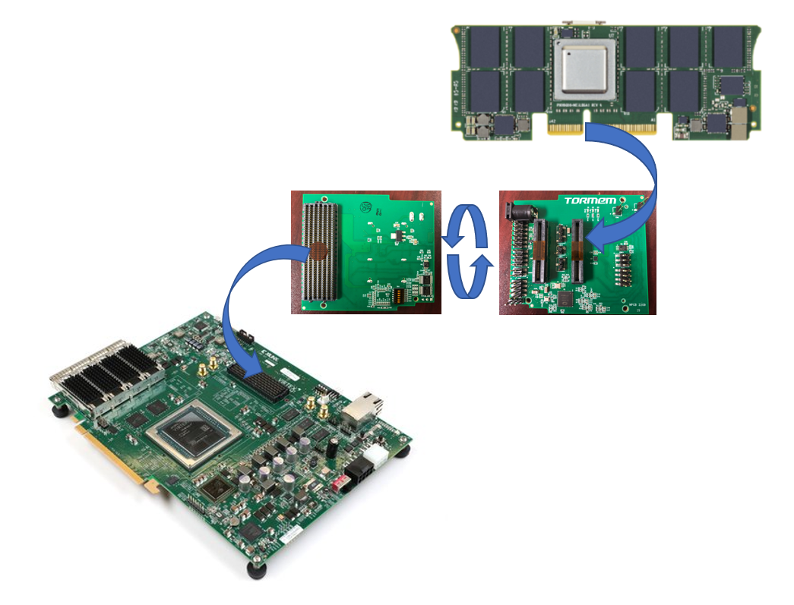
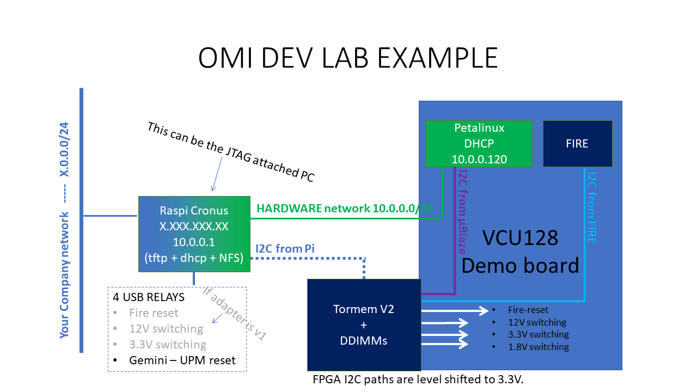

# OMI ENABLEMENT Guide

## HARDWARE DESCRIPTION

For the purpose of open sourcing the design, a collaboration between OMI members led to a tuning of an OMIhost FPGA reference design "[Fire](../fire/)" to be used in a [VCU128 Card] from AMD/Xilinx.

[VCU128 Card]: https://www.xilinx.com/products/boards-and-kits/vcu128.htmlhttps://www.xilinx.com/products/boards-and-kits/vcu128.html

With addition of a simple FMC+ connected add-on card, any OMI compatible memory DDIMM module can be evaluated.

The setup allows evaluation of 2 DDIMMs modules in slots A and B.

Some code is required to synchronize and test the OMI DDIMMs.

Enablement example codes have been developed in Python and in C. Same functions are available.

Either the code is executed in a companion raspberry pi or any I2C capable computer, or even in an embedded microblaze processor (in the latter case use the C version as it executes much faster)

Python source code is available at : [Python Code]

[Python Code]:https://github.com/OpenCAPI/omi_enablement/tree/main/python

Python code documentation is available at : [Python Documentation]

[Python Documentation]:../python

C source code is available at : [C Code]

[C Code]:https://github.com/OpenCAPI/omi_enablement/tree/main/c

C code documentation is available at : [C Documentation]

[C Documentation]:../c_code

Enablement example code

- Checks I2C tree
- Synchronizes DDIMMs
- Executes simple transfers in memory (not published yet)

!!! Note    "Note: The Raspberry pi can host an Cronus server, should you want to evaluate OMI in a Cronus environment."

## REQUIREMENTS

Requirements depends on what kind of experiments need to be conducted.

- Cronus with a raspberry pi hosting a Cronus server and dealing with I2C accesses (out of present scope)
- Standalone Python or C code running on Raspberry Pi or a PC with I2C capabilities
- Embedded PetaLinux with Microblaze next to Fire in the FPGA
  - requires TFTP / NFS / DNS server to host boot and file system
  - can run C standalone code (Python is too slow to execute in a timely manner)
- Standalone C code running on a no-OS Microblaze embedded processor (not developed yet)
  - only requires a serial terminal (can be ["picocom"](https://linux.die.net/man/8/picocom) using UART through programming USB cable)

Minimum Hardware requirements :

Procure the following:

- A VCU128 Board from [AMD/Xilinx](https://www.xilinx.com/) and a JTAG controlling PC (can be the Raspberry pi)
- An adapter board from [Tormem](https://www.tormem.com/). 
  - as of today only V1 is available
    - Version 1 allows basic DDIMM interface
    - Version 2 will also allow FIRE reset and power control of 12V, 3.3V and 1.8V.
- At least one DDIMM module
- A USB relay card to ensure automated fire reset / 3.3V / 12V POWER control (if using an adapter board version 1)

Software requirements : 

- Obtain an AMD/Xilinx Licence for Vivado. Requires **2018.3** version for this contribution (best timing results at maximum bandwidth).

## ENABLEMENT STEPS with an external I2C master

git clone the "[vcu128_enablement](https://github.com/opencapi/omi_host_fire/tree/vcu128_enablement)" branch of Fire design. 

First synthetize, implement and generate bitstream of "FIRE" design for the VCU128 using the specific branch as specified in the README.md file.

git clone the [https://github.com/OpenCAPI/omi_enablement/](https://github.com/OpenCAPI/omi_enablement/) and use `/python` or `/c` directory with a debugging raspberry pi or any computer with I2C capability to check you can see the design.

Choose Python or C control, both will send requests through the I2C bus to the Fire design. Explorer chip are usually access through In band commands are dealt by Fire.

## ENABLEMENT STEPS with internal Microblaze as I2C master

!!! Warning    "When using Tormem adapter board version 1, I2C control by Microblaze requires a hacking of the VCU128 board as there is no provision to connect an external cable."

1. git clone the "[vcu128_enablement](https://github.com/opencapi/omi_host_fire/tree/vcu128_enablement)" branch of Fire design. 

2. First synthetize, implement and generate bitstream of "FIRE" design for the VCU128 using the specific branch as specified in the README.md file.

3. To prepare the integration of FIRE and microblaze structure, generate an IP of Fire design.

4. Git clone the "[omi_enablement](https://github.com/OpenCAPI/omi_enablement.git)" to get the necessary material to build a {Fire + Microblaze} structure.

5. Hardware: Option 1 : re-create your own design {FIRE + Microblaze}

   1. From the "hw/" directory, use hw_script.sh and tcl_code.tcl to generate a microblaze environment.
      you'll be ask to provide the FIRE ip path from step 3.
   2. you'll get the .xsa file which is the only file required for the remaining steps. It contains a complete description of the hardware.
   3. Hardware Option 2: use pre-built hardware system.bit.

6. Install [petalinux](https://www.xilinx.com/products/design-tools/embedded-software/petalinux-sdk.html) (we used the 2021.1 version)

7. Software Option 1: create your petalinux environment

   1. using petalinux-create, create a `vcuomi` project directory. `petalinux-create --type project --template microblaze --name vcuomi`
   2. remaining tasks: To Be described
   3. ...

8. Software Option 2: Use pre_built linux

   1. Use https://github.com/OpenCAPI/omi_enablement/tree/main/petalinux content 

   2. run the script.sh

   3.  and then 

      wsl@wsl:~/omi_enablement/petalinux$ petalinux-create --type project -s \*.bsp

      wsl@wsl:~/omi_enablement/petalinux$ mkdir vcuomi/images && mkdir vcuomi/images/linux

      wsl@wsl:~/omi_enablement/petalinux$ cp -r linux/images/\* vcuomi/images/linux/.

9. copy the `images/linux` content to your tftp directory of the remote computer acting as a server.

10. From the remote tftp/NFS server: copy the tftp/rootfs.tar.gz directory to your NFS directory.

11. Adjust permissions accordingly.

12. From `petalinux` installation dir use `xsct -nolrwrap`  to load the system.bit into the fpga.

13. open a picocom or any RS232 terminal on the FPGA RS232 link.

14. trigger a boot of the microblaze with petalinux-boot.