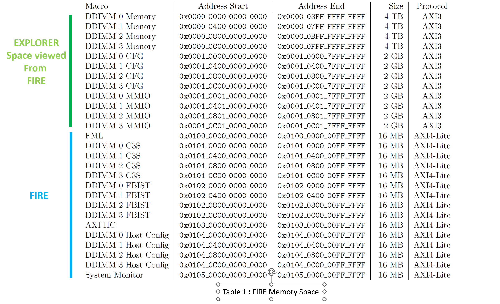

# OMI ENABLEMENT DETAILS


## OMI Host / FIRE memory mapping and Access

a.	Memory mapping
The host offers 2 types of accesses. 

First of them deals with its own internal registers. Most used among them are:

- FML (FIRE Miscellaneous Library) containing mainly the Fire version and the reset of the devices
- C3S (OpenCAPI Command and Configure Sequencer) used to manually create an OMI frame (called flit) 
- FBIST (Function Built-In Self Test) used to automatically generate and check high bandwidth traffic on the OMI links.


The host can also access all memory mapping of the DDIMM devices (up to 4 devices)



​												Table 1: FIRE memory space

### Example of FIRE internal register

#### i.	Read FIRE_VERSION in register @0x00 of FML Group 

`python3 omi.py read -c fire -r 0x100000000000000`
`Rd Fire Addr 0x100000000000000 : 0x000000003e29c7d2`
This register contains

- [31:29]: ‘001’:  frequency used for the internal clock of the FPGA which determines the OMI link frequency [ 1= 21.33 GBPS, 2 =23.46 GBPS, 3=25.6 GBPS]
- [28]: ‘1’: dirty bit is used when the current image contains change not committed to the git version control
- [27:0]: ‘29c7d2’ is the git level of the code


#### ii.	Reset/unreset the DDIMM0 device

Reseting the DDIMMs is performed by the host.

```
python3 omi.py read -c fire -r 0x100000000000004
Rd Fire Addr 0x100000000000004 : 0x000000000000003f
```

Reset the DDIMM0 (bit3)

```
python3 omi.py write -c fire -r 0x100000000000004 -d 000000037
Wr Fire Addr 0x100000000000004 : 0x0000000000000037
Writing check : Success
```

```
python3 omi.py write -c fire -r 0x100000000000004 -d 000000037
Wr Fire Addr 0x100000000000004 : 0x000000000000003f
Writing check : Success
```


#### iii.	Bad address access

As soon as a bad i2C address is accessed, you may encounter one of the 4 different types of error answer:

The answer “dec0de1c” will be sent by AMD/Xilinx AXI crossbar as an answer to an unknown address (out of range, as defined for example in [axi_regs_32.vhdl](https://github.com/OpenCAPI/omi_host_fire/blob/master/fire/src/vhdl/axi_regs_32.vhdl)

```
python3 omi.py read -c fire -r 0x1000F0000000004
Rd Fire Addr 0x1000f0000000004 : 0x00000000dec0de1c
```

The answer “dec0deff” will be sent as an answer to address that is not modulo 4.

```
~/python/v6 $ python3 omi.py read -c fire -r 0x100000000000000
Rd Fire Addr 0x100000000000000 : 0x00000000335b5587
~/python/v6 $ python3 omi.py read -c fire -r 0x100000000000001
Rd Fire Addr 0x100000000000001 : 0x00000000dec0deff
~/python/v6 $ python3 omi.py read -c fire -r 0x100000000000002
Rd Fire Addr 0x100000000000002 : 0x00000000dec0deff
~/python/v6 $ python3 omi.py read -c fire -r 0x100000000000003
Rd Fire Addr 0x100000000000003 : 0x00000000dec0deff
~/python/v6 $ python3 omi.py read -c fire -r 0x100000000000004
Rd Fire Addr 0x100000000000004 : 0x000000000000003f
```

The answer “dec0de00” will be sent as an answer to a register address that the hardware has not  preset.

```
~/python/v6 $ python3 omi.py read -c fire -r 0x101000000030008
Rd Fire Addr 0x101000000030008 : 0x00000000dec0de00
```

The answer “dec0de0b” will be sent as an answer to an address existing in the AXI range definition, but the hardware doesn't handle.

```
~/python/v6 $ python3 omi.py read -c fire -r 0x101000000030040
Rd Fire Addr 0x101000000030040 : 0x00000000dec0de0b
```

In the event you have modified the hdl design and not properly taken care of a memory range, an I2C error will be raised, and a reset of the fire chip will be needed if you access a bad address in an unallowed range!

```
python3 omi.py read -c fire -r 0x<in range but not answering address>
OSError: [Errno 5] Input/output error
```

!!! Note    "Note: When this occurs a reset of the chip is required."

## OMI Device DDIMM OCMB memory mapping and access

Contact Microchip support to obtain detailed information on firmware

Following propositions are only examples provided to help the discovery of OMI technology.

### a.	Memory mapping

An EXPLORER register can be accessed in two ways:

- Directly through I2C. The user will need to select the port of the DDIMM to switch the I2C path to the EXPLORER he wants to access
- Indirectly through FIRE. The OMI links between FIRE and EXPLORER need to be trained to use the “in-band” access. To select the EXPLORER register he wants to access, the user will use a specific address depending on the port number.

Each EXPLORER register can be accessed through different addresses. 

The reference used is the Microchip "Explorer_registers_Mips_view.pdf" document. 

The 0x808xxxx registers are ordered by pair but can be accessed alone or by pair.

As an example, let’s access the register 
0x8084168: OCMB - MB_SIM_MMIO_OTRCFG76_LEFT and 
0x808416C: OCMB - MB_SIM_MMIO_OTRCFG76_RIGHT. 

They can be accessed either by their « register address », by their « SCOM address », by their « MMIO address » or by their « FIRE adress »:

- Register Address			:   @0x08084168 and @0x0808416C	(32 bits access)
- I2C Register Address	   : @0xA8084168 and @0xA808416C	(32 bits access)
- SCOM Address: Reg@0x8084168/C >> 3 	=> SCOM@ 0x801082D		(64 bits access)
- MMIO Address: Reg@8084168/C	=> MMIO@ @0026C/8			(32 bits access)
- FIRE Address: 			=> 0x3001000140084168		(64 bits access)

To access different slots through FIRE, use the appropriate offset:

- DDIM_0_CFG / Port A: 0x3001_0001_4008_4168
- DDIM_1_CFG / Port B: 0x3001_0401_4008_4168

### b.	Registers access

### i.	I2C access (at any time and directly in EXPLORER chip)

DDIMM / Port is selected by the I2C switch on the Tormem adapter board 

```
python3 omi.py initpath -d a #(done once to select the right OMI DDIMM / Port)
```

MB_SIM_MMIO_OTRCFG76_LEFT + MB_SIM_MMIO_OTRCFG76_RIGHT 
64 bits Read SCOM@ @801082D => 0x0000000f_00000000

```
python3 omi.py read -c exp -r 0801082D => 0x0000000f00000000
```

64 bits Write SCOM@ @801082D => 0x000000ff_00000000 

```
python3 omi.py write -c exp -r 0801082D -d 0x0000ff00000000
```

MB_SIM_MMIO_OTRCFG76_LEFT  => Reg @0x8084168  I2C Reg @0xA8084168 = SCOM @0801082D
32 bits Read Reg@ @0x8084168 => 0000000F

```
python3 omi.py readreg -c exp -r 0x8084168 =>0x0000000F
```


32 bits Write Reg@ @0x8084168 => 000000FF (always start by lower address pair and then upper address pair)

```
python3 omi.py writereg -c exp -r 0x8084168 -d 0x000000FF
```

MB_SIM_MMIO_OTRCFG76_RIGHT => Reg @0x808416C = I2C Reg @0xA808416C = SCOM @0801082D
32 bits Read Reg@ @0x808416C => 00000000 

```
python3 omi.py readreg -c exp -r 0x808416C => 0x00000000
```

32 bits Write Reg@ @0x808416C => 000000AA (always start by lower address pair and then upper address pair)

```
python3 omi.py writereg -c exp -r 0x808416C -d 0x000000AA
```


### ii.	In-Band access using the FIRE DDIMM_0 MMIO register address

(access is done through FIRE only after OMI Links are trained)
DDIMM / Port is selected by the address used

DDIM_0_MMIO / Port A: 0x3001_0001_4008_4168

DDIM_1_MMIO / Port B: 0x3001_0401_4008_4168
MB_SIM_MMIO_O0MBIT_O0DID_LEFT + MB_SIM_MMIO_O0MBIT_O0DID_RIGHT 
64 bits Read Reg@ @08084168 => 0x00000f_00000000

64 bits Write Reg@ @08084168 => 0x0000ff_00000000 

```
python3 omi.py read -c fire -r 0x3001000140084168 => 0x0000000f00000000
```

64 bits Write Reg@ @08084168 => 0x0000ff_00000000 

MB_SIM_MMIO_OTRCFG76_LEFT  	=> MMIO @0026C = Reg @0x8084168 = SCOM @0801082D
32 bits Read MMIO@ @0026C => 0000000F

32 bits Write MMIO@ @0026C => 000000FF

```
python3 omi.py read -c fire -r 0x200100000000026c => 0x000000000000000f
```

32 bits Write MMIO@ @0026C => 000000FF

```
python3 omi.py write -c fire -r 0x3001000140084168 -d 0x000000ff00000000
```

MB_SIM_MMIO_OTRCFG76_LEFT  	=> MMIO @0026C = Reg @0x8084168 = SCOM @0801082D
32 bits Read MMIO@ @0026C => 0000000F
python3 omi.py read -c fire -r 0x200100000000026c => 0x000000000000000f
32 bits Write MMIO@ @0026C => 000000FF

MB_SIM_MMIO_OTRCFG76_RIGHT  	=> MMIO @00268 = Reg @0x808416C = SCOM @0801082D
32 bits Read MMIO@ @00268 => 00000000

```
python3 omi.py write -c fire -r 0x200100000000026c -d 0x000000ff
```

MB_SIM_MMIO_OTRCFG76_RIGHT  	=> MMIO @00268 = Reg @0x808416C = SCOM @0801082D
32 bits Read MMIO@ @00268 => 00000000

32 bits Write MMIO@ @00268 => 00000000

```
python3 omi.py read -c fire -r 0x2001000000000268 => 0x0000000000000000
```

32 bits Write MMIO@ @00268 => 00000000

Notice the address swap with 32 bits access!
MMIO @0026C => Reg @0x8084168

```
python3 omi.py write -c fire -r 0x2001000000000268 -d 0x00000000
```

Notice the address swap with 32 bits access!
MMIO @0026C => Reg @0x8084168

### iii.	In-Band access using C3S to manually build a Flit

(access is done through Fire only after OMI Links are trained)
Pre-requisite => Only template 0 is allowed.

32 bits Read MMIO@ @0026C => FADAFAAB
Control array => C3S RESP WRITE ADDR RESET

```
python3 omi.py read  -c fire -r 0x2001000000000224 => 0x00000221
python3 omi.py write -c fire -r 0x2001000000000224 -d 0x00000001
```

32 bits Read MMIO@ @0026C => FADAFAAB
Control array => C3S RESP WRITE ADDR RESET

Data array

```
python3 omi.py write -c fire -r 0x0101000000030004 -d 0x0000000000000200
```

Data array

Flow Array

```
python3 omi.py write -c fire -r 0x010100000000000E -d 0x0000000000000000
python3 omi.py write -c fire -r 0x0101000000000006 -d 0x0000000040000000
python3 omi.py write -c fire -r 0x0101000000000005 -d 0x0000000000000000
python3 omi.py write -c fire -r 0x0101000000000004 -d 0x000000000026C000
python3 omi.py write -c fire -r 0x0101000000000003 -d 0x0000000000E00000
```

Flow Array

Control Array

```
python3 omi.py write -c fire -r 0x0101000000020000 -d 0x0000000080000001
python3 omi.py write -c fire -r 0x0101000000020100 -d 0x0000000000000100
```

Control Array

Response Array	to access 0x26C~64/4=B, read 1020B

```
python3 omi.py read  -c fire -r 0x0101000000030000 => 0x0000000000000008
python3 omi.py write -c fire -r 0x0101000000030000 -d 0x0000000000000009
python3 omi.py read  -c fire -r 0x0101000000030000 => 0x0000000000000008
python3 omi.py read  -c fire -r 0x0101000000030000 => 0x0000000000000008
python3 omi.py write -c fire -r 0x0101000000030000 -d 0x000000000000000A
```

Response Array	to access 0x26C~64/4=B, read 1020B

32 bits Write MMIO@ @0026C => ABCDEFAA

```
python3 omi.py read  -c fire -r 0x010100000001020B => 0x00000000FADAFAAB
```

32 bits Write MMIO@ @0026C => ABCDEFAA

Flow Array

```
Data Array
python3 omi.py write -c fire -r 0x010100000000000E -d 0x0000000000000001
python3 omi.py write -c fire -r 0x0101000000000006 -d 0x0000000040000000
python3 omi.py write -c fire -r 0x0101000000000005 -d 0x0000000000000000
python3 omi.py write -c fire -r 0x0101000000000004 -d 0x000000000026C000
python3 omi.py write -c fire -r 0x0101000000000003 -d 0x0000000000E10000
```

Flow Array

Control Array

```
python3 omi.py write -c fire -r 0x0101000000020000 -d 0x0000000080000001
python3 omi.py write -c fire -r 0x010100000000010B -d 0x00000000ABCDEFAA
python3 omi.py write -c fire -r 0x0101000000020100 -d 0x0000000080000002
python3 omi.py write -c fire -r 0x0101000000020200 -d 0x0000000080000003
python3 omi.py write -c fire -r 0x0101000000020300 -d 0x0000000000000100
```

Control Array

Reassign default value for supported templates
python3 omi.py write -c fire -r 0x2001000000000224 -d 0x00000221

```
python3 omi.py read  -c fire -r 0x0101000000030000 => 0x0000000000000008
python3 omi.py write -c fire -r 0x0101000000030000 -d 0x0000000000000009
python3 omi.py read  -c fire -r 0x0101000000030000 => 0x0000000000000008
python3 omi.py read  -c fire -r 0x0101000000030000 => 0x0000000000000008
python3 omi.py write -c fire -r 0x0101000000030000 -d 0x000000000000000A
```

Reassign default value for supported templates
python3 omi.py write -c fire -r 0x2001000000000224 -d 0x00000221