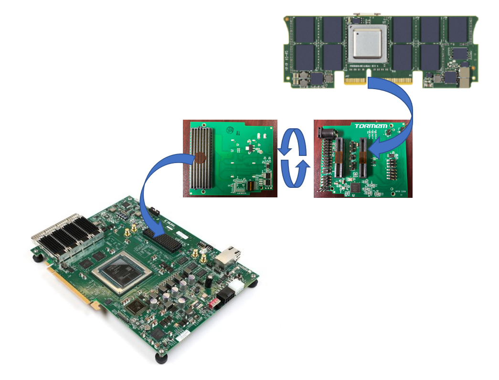

# OMI ENABLEMENT Setup

## HARDWARE DESCRIPTION

For the purpose of open sourcing the design, a collaboration between OMI members led to a tuning of an OMIhost FPGA reference design "[Fire](../fire/)" to be used in a [VCU128 Card] from AMD/Xilinx.

[VCU128 Card]: https://www.xilinx.com/products/boards-and-kits/vcu128.htmlhttps://www.xilinx.com/products/boards-and-kits/vcu128.html

With addition of a simple FMC+ connected add-on card, any OMI compatible memory DDIMM module can be evaluated.

The setup allows evaluation of 2 DDIMMs modules in slots A and B.

Some code is required to synchronize and test the OMI DDIMMs.

Enablement example codes have been developed in Python and in C. Same functions are available.

Either the code is executed in a companion raspberry pi or any I2C capable computer, or even in an embedded microblaze processor (in the latter case use the C version as it executes much faster)

Python source code is available at : [Python Code]

[Python Code]:https://github.com/OpenCAPI/omi_enablement/tree/main/python

Python code documentation is available at : [Python Documentation]

[Python Documentation]:../python

C source code is available at : [C Code]

[C Code]:https://github.com/OpenCAPI/omi_enablement/tree/main/c

C code documentation is available at : [C Documentation]

[C Documentation]:../c_code

Enablement example code

- Checks I2C tree
- Synchronizes DDIMMs
- Executes simple transfers in memory (not published yet)

!!! Note    "Note: The Raspberry pi can host an Cronus server, should you want to evaluate OMI in a Cronus environment."

## REQUIREMENTS

Requirements depends on what kind of experiments need to be conducted.

- Cronus with a raspberry pi hosting a Cronus server and dealing with I2C accesses (out of present scope)
- Standalone Python or C code running on Raspberry Pi or a PC with I2C capabilities
- Embedded PetaLinux with Microblaze next to Fire in the FPGA
  - requires TFTP / NFS / DNS server to host boot and file system
  - can run C standalone code (Python is too slow to execute in a timely manner)
- Standalone C code running on a no-OS Microblaze embedded processor (not developed yet)
  - only requires a serial terminal (can be ["picocom"](https://linux.die.net/man/8/picocom) using UART through programming USB cable)

Minimum Hardware requirements :

Procure the following:

- A VCU128 Board from [AMD/Xilinx](https://www.xilinx.com/) and a JTAG controlling PC (can be the Raspberry pi)
- An adapter board from [Tormem](https://www.tormem.com/). 
  - as of today only V1 is available
    - Version 1 allows basic DDIMM interface
    - Version 2 will also allow FIRE reset and power control of 12V, 3.3V and 1.8V.
- At least one DDIMM module
- A USB relay card to ensure automated fire reset / 3.3V / 12V POWER control (if using an adapter board version 1)

Software requirements : 

- Obtain an AMD/Xilinx Licence for Vivado. Requires **2018.3** version for this contribution (best timing results at maximum bandwidth).

## ENABLEMENT STEPS with an external I2C master

git clone the "[Host FIRE](https://github.com/opencapi/omi_host_fire/)" repository of Fire design. 

First synthetize, implement and generate bitstream of "FIRE" design for the VCU128 using the specific branch as specified in the README.md file.

git clone the [https://github.com/OpenCAPI/omi_enablement/](https://github.com/OpenCAPI/omi_enablement/) and use `/python` or `/c` directory with a debugging raspberry pi or any computer with I2C capability to check you can see the design.

Choose Python or C control, both will send requests through the I2C bus to the Fire design. Explorer chip are usually access through In band commands are dealt by Fire.

## ENABLEMENT STEPS with internal Microblaze as I2C master

!!! Warning    "When using Tormem adapter board version 1, I2C control by Microblaze requires a hacking of the VCU128 board as there is no provision to connect an external cable."

1. git clone the "[Host FIRE](https://github.com/opencapi/omi_host_fire/)" repository of Fire design. 

2. First synthetize, implement and generate bitstream of "FIRE" design for the VCU128 using the specific branch as specified in the README.md file.

3. To prepare the integration of FIRE and microblaze structure, generate an IP of Fire design.

4. Git clone the "[omi_enablement](https://github.com/OpenCAPI/omi_enablement.git)" to get the necessary material to build a {Fire + Microblaze} structure.

5. Hardware: Option 1 : re-create your own design {FIRE + Microblaze}

   1. From the "hw/" directory, use hw_script.sh and tcl_code.tcl to generate a microblaze environment.
      you'll be ask to provide the FIRE ip path from step 3.
   2. you'll get the .xsa file which is the only file required for the remaining steps. It contains a complete description of the hardware.
   3. Hardware Option 2: use pre-built hardware system.bit.

6. Install [petalinux](https://www.xilinx.com/products/design-tools/embedded-software/petalinux-sdk.html) (we used the 2021.1 version)

7. Software Option 1: create your petalinux environment

   1. using petalinux-create, create a `vcuomi` project directory. `petalinux-create --type project --template microblaze --name vcuomi`
   2. remaining tasks: To Be described
   3. ...

8. Software Option 2: Use pre_built linux

   1. Use https://github.com/OpenCAPI/omi_enablement/tree/main/petalinux content 

   2. run the script.sh

   3. and then 

      wsl@wsl:~/omi_enablement/petalinux$ petalinux-create --type project -s \*.bsp

      wsl@wsl:~/omi_enablement/petalinux$ mkdir vcuomi/images && mkdir vcuomi/images/linux

      wsl@wsl:~/omi_enablement/petalinux$ cp -r linux/images/\* vcuomi/images/linux/.

9. copy the `images/linux` content to your tftp directory of the remote computer acting as a server.

10. From the remote tftp/NFS server: copy the tftp/rootfs.tar.gz directory to your NFS directory.

11. Adjust permissions accordingly.

12. From `petalinux` installation dir use `xsct -nolrwrap`  to load the system.bit into the fpga.

13. open a picocom or any RS232 terminal on the FPGA RS232 link.

14. trigger a boot of the microblaze with petalinux-boot.

## I2C architecture foreword

I2C is either used in a traditional manner, ie Master issues a R or W to a I2C chip adress. The addressed chip also provides an internal register address.

That's the case for EEPROM, PMIC (Power Managment IC), I2C muxes etc ..

As far as FIRE and EXPLORER are concerned, they are accessed using different modes depending on which register is concerned.

Internal registers are accessed through an indirect mecanism, and inband is possible for devices, hence this documentation.

## I2C tree

## I2C components

- Master: Raspberry pi or any I2C capable computer
- Host component from Apollo or VCU128 board containing a FPGA with a FIRE host design at @0x38 
- For each DDIMM :
  - DDIMM EEPROM containing VPD data at I2C@0x50
  - PMIC1 and PMIC2 (Power Management Integrated Circuits) setting the Power supplied of the board at @0x4F and @0x67
  - OMI DDIMM OCMB (OpenCAPI Memory Buffer also called Explorer) at @0x20 

## Reset and power supply control

DDIMM Exporer reset signal is controlled through an FMC+ connector lane and a FIRE FML register, while FIRE reset is required with an external logic. This logic can be easily performed with a set of USB controlled electromechanical relays hooked up to the controlling computer.

The same relay board an control power supplies through the adapter power supply connector.

Each development lab need to tune this signals to allow resetting FIRE and switch on and off power supplies at any time.

## Specific DDIMM I2C path

Tormem adapter board can have up to 2 devices. Each of them can be accessed through I2C using a multiplexer switch.

After a power on and Fire reset:

Select the proper DDIMM I2C path (set the adapter mux accordingly)

~/vcu128_ctl_sh/i2c_reset.sh ;  python3 omi.py initpath -d a

To check with mux is selected, use the following command:

python3 omi.py checkpath`

Once Path is set, the init routine will power on the 2 DDIMM PMICS. No DDIMM selection, as it will power on the currently selected DDIMM.
`python3 omi.py init`

Once I2C path is set and DDIM is powered on, we can list the viewable devices using Adapter version 1:

Typically, you will identify the FIRE host as @0x38, the OMI DDIMM device as @0x20, the EEPROM as @0x50, the 2 PMIC as @0x4F and 0x67 and the different muxes at @0x71 and 0x73 from the Adapter board.

FIRE I2C is a slave component set with 0x38 as I2C address. This FIRE I2C provides access to all address mapping from the host side as well as from the device sides. 

After a reset of the Xilinx AXI-IIC IP initialization of the IP is preformed as follow:

-	Soft reset (SOFTR @040)
-	Slave Mode Select (CR @100)
-	Enable AIX IIC controller (CR @100)
-	Set I2C slave address to 0x38 (ADDR @110)
-	Set an irq if fifo is full (16 locations filled) (RX_FIFO_PIRQ @120)
  The I2C protocol is not used as the typical one, meaning that any I2C access (either “read” or “write”) fills the I2C Rx FIFO with almost 1 word. The state machine associated to this I2C IP (i2c_ctrl_mac) is polling indefinitely the I2C IP (axi_iic). As soon as it detects that the Rx FIFO is not empty then 8x8bits words are read (even if only 1 byte was written). Afterwards if the FIFO is empty, it means that the access is a “read”, otherwise the logic will read another 8x8bits words while considering the operation as a “write”.
  To summarize:
-	8x I2C 8bits-words received corresponds to a FIRE register address to read. 
-	16x I2C 8bits-words received corresponds to the FIRE register address and the data to write
-	Read or write of 1 word will generate a “decode1c” response (generated by the AXI bridges) written to the I2C FIFO
-	As soon as a word is written in the I2C IP at @0x38, then “i2c_ctrl_mac” picks the data as an address and accesses the appropriate component. If required access is a “read”, then the data collected from the component is written to the axi_iix TX fifo. If the required access is a “write”, then the data is read by the “i2c_ctrl_mac” and sent to the appropriate component.

Reading FIRE's ID register:

It contains the git revision of the hardware build and few other information:

`python3 omi.py read -c fire -r 0x100000000000000`
`Rd Fire Addr 0x100000000000000 : 0x000000003e29c7d2 `   (This an example of git level)

## Conclusion 

At this level you should have all necessary hardware and software to access FIRE.

Check [Enablement details page](./enablement_details.md) to get further information on FIRE and EXPLORER registers and memory space accesses.

Go back to the [enablement](./enablement.md) page